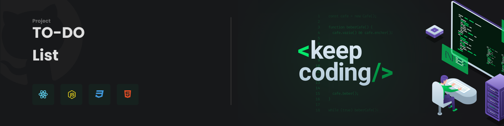
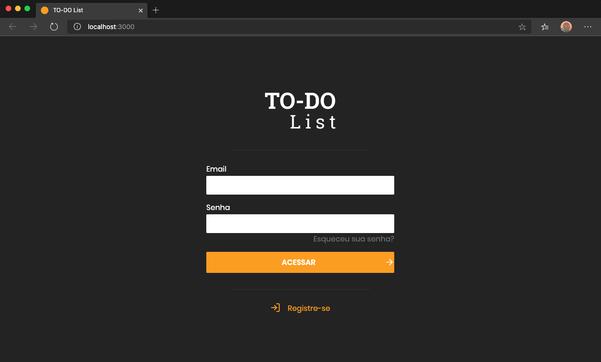
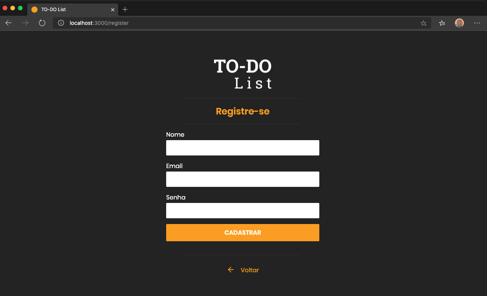
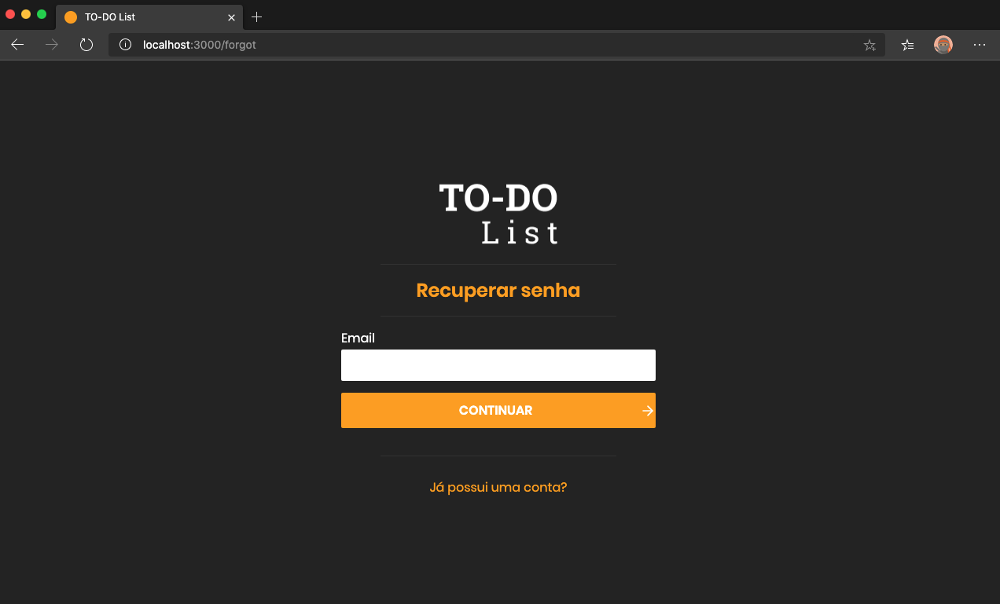
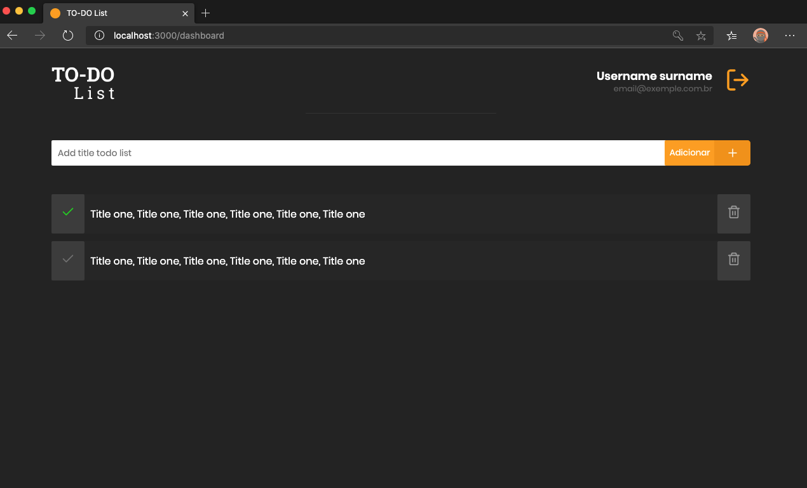

<p align="center">
  <a href="" rel="noopener">
 </a>
</p>

<h3 align="center">TO-DO List</h3>

---

## 📝 Navegação

- [Preview](#preview)
- [Instalando Dependências](#installing)
- [Uso](#usage)
- [Construído utilizando](#built_using)
- [Author](#author)


## 🚀 Preview<a name = "preview"></a>

<div align="center">
  
  
  
  
</div>

### Requisitos

Ter instalado pelo menos um gerenciador de pacotes do Node, [Npm](https://www.npmjs.com/) ou [Yarn](https://yarnpkg.com/).


Primeiramente precisa clonar o projeto, segue o passo conforme abaixo:

```bash
  $ git clone https://github.com/LuanAmaro/todo-list-reactjs.git
  $ cd todo-list-reactjs
```
## 📦 Installing Dependencies <a name="installing"></a>

Executar na raiz do projeto o seguinte comando para instalar as dependências

```bash
$ yarn
// ou $ npm install
```


## 🎈 Uso <a name="usage"></a>

```bash
$ yarn start
```

## ⛏️ Construído utilizando <a name = "built_using"></a>
- [ReactJs](https://pt-br.reactjs.org/)
- [Javascript](https://www.javascript.com/)
- [HTML](https://developer.mozilla.org/pt-BR/docs/Web/HTML)
- [CSS](https://developer.mozilla.org/pt-BR/docs/Web/CSS)

## ✍️ author <a name = "author"></a>

👤 **Luan Amaro**

* Github: [@LuanAmaro](https://github.com/LuanAmaro)
* LinkedIn: [@luan-amaro-59638b1a0](https://www.linkedin.com/in/luan-amaro)
